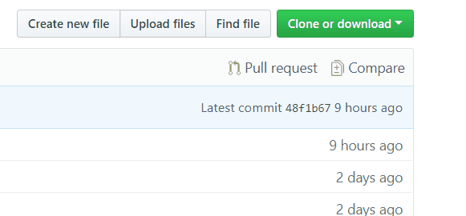

+++
date = "2017-10-11T12:24:00"
draft = false
tags = ["csitauthority"]
title = "Be a part of the family"
math = true
summary = """
Getting started on how to contribute content to CSITauthority 
"""

#[header]
#image = ""
#caption = "Image credit: [****]()"

+++

{}
It is important to note that if you're trying to contribute towards a specific semester, this is not the place; every semester has [it's own repository.](https://github.com/csitauthority/ "click and explore other repositories")
{}

Although this guide prepares you for the main repository, you can follow the general guide given below to contribute in any part of CSITauthority. The method is similar, with slight changes, for other repositories.

## Easy steps:
##### (One Time Setup; Step-1 & 2)

1. Fork the repository
	* Go to the main repository page and, on the upper-left corner, click the `fork` button.

	&nbsp;

2. Copy remote URL and clone
	{}
	

It should look something like this: 

https:&#047;&#047;github.com&#047;`UserName`&#047;CSITauthority.github.io.git

	UserName = Your Github Username

{}

	{}

* First, determine a location on your device to save the repository.
* On the Start Menu, search `Git Bash`
* To change the path to (_say_)D-drive, type `cd d:`
	
* It's not over, just yet. You'll notice that there is an empty folder `HUGO/themes/csitauthority-academic`. Its empty, by design (_you'll know later_).
* To populate it, type these commands in order(_resume from the last step_)
	* `cd csitauthority.github.io` to change Path into the repository.
	* `git submodule init` to initialize the theme submodule.
	* `git submodule update` to update the theme submodule.
	
{}Congratulations! Your __one-time__ setup of CSITauthority repository is over. All and any changes you make in the future will be very easy to collaborate with everybody!{}

{}

	&nbsp;
{}The following simple steps are necessary whenever you want to send your changes or, receive changes made my everybody else{}
3. Commiting and Pushing changes
	{}
* On a freshly cloned repository, make changes as desired. (_However, If you have cloned ages ago, it makes sense to first `fetch` before making any changes_)
* ie. For __old clones__, these two simple commands should make them up-to-date
	* `git fetch`
	* `git merge`
{}

	{}
* Once you are satisfied with the changes that you've made, you can choose to commit. A commit is like a confirmation for a change; _you're literally committing to that particular change:_
* Commits __need__ reason. Hence, each commit is followed by a short message describing the change. `fixed the pagination bug`, `added new functionality to the partial`, `Update to an article`,`Added TU 2074 WebTech Question Papers`, etc.
* __Commits are painfully__ ___easy___ __to do__
	* `git add .` to ready all the changes you're made, for the commit
	* `git commit -m "commit-message"` to make a commit.
	_Make it meaningful._ example:

			git commit -m "Wrote a post on NLP"

	* `git push` to send your commit to your forked repository.
{}

	&nbsp;

4. Send a pull request
	{}
* All of the hard part is behind us. Sending a pull request is easy.
	* Go to your forked repository on your browser
	* Click on make a pull-request
	* Thats literally it! :)
	
{}
{}Look forward to your post in the next website build, _that happens frequently_.Your changes should already be available inside `master/HUGO/` after your pull request has been accepted.{}

